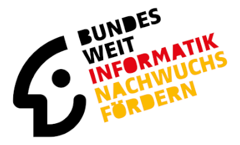
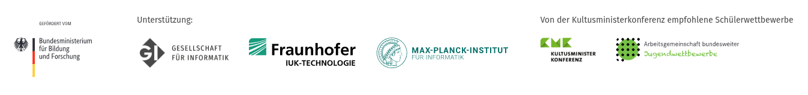

    

# Solutions for the first round of the 43. Bundeswettbewerb Informatik 2025

This repository contains the solutions to the tasks of round 1 in the [43. Bundeswettbewerb Informatik](https://bwinf.de/bundeswettbewerb/43/).

**Please note that, as this is a German competition, comments inside of the code and the docs are in German as well.**

You can find the solutions for tasks 1, 2, 3 and 5 in the `src` folder.

**IMPORTANT!** Task 5 is an incomplete solution and was not included in the final rating by the jury, as only the 3 best solutions are summed up and taken into account.

## Rating of the solutions by the jury

The solutions in this repository have already been handed in and evaluated by the jury of the competition. These are the results.

Task                                | Rating
------------------------------------|--------
1 ("Hopsitexte")                    | 5 / 5
2 ("Schwierigkeiten")               | 5 / 5
3 ("Wandertag")                     | 4 / 5
*task 4 has not been solved by us*  |
5 ("Ägyptisches Grabmal")           | 3 / 5

The three best solutions are summed up to form the final score: **14 / 15 (93%)**

**Resulting verdict by the jury**: 1st prize

## Further info

Also see the [LICENSE](./LICENSE) of this repository.

---

The *Bundeswettbewerb Informatik* is brought to you by:

